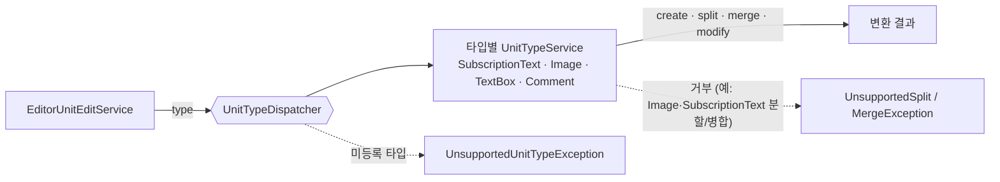
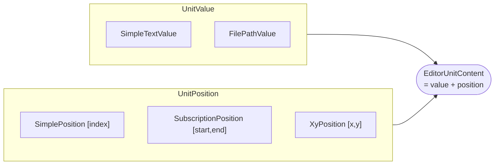
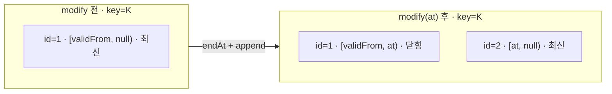
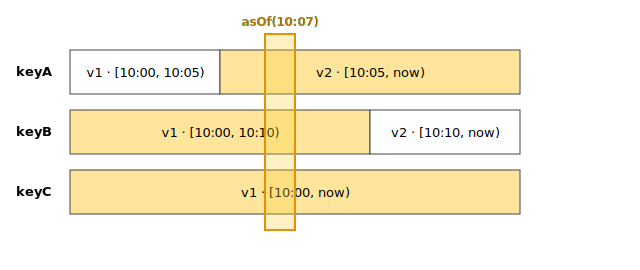

# 에디터 유닛 — 타입 확장과 Temporal 버저닝

> 이미지·텍스트 등 이종 리소스의 타입·값·위치·액션 확장을 코어 수정 없이 흡수하는 에디터 도메인. \
> 편집 단위를 유효구간(`[validFrom, validTo)`)·계보를 가진 temporal 애그리거트로 모델링 — 이력 무손실·임의 시점 복원.

---

## ① 맥락 / 문제

**배경 — MVP 프로덕트 기반 코드의 한계.** 특정 콘텐츠 종류·공정 조합에 강결합 — **작업물 축**(새 콘텐츠 타입)·**작업 축**(새 편집 단계) 양쪽 확장이 막히고, 소규모 팀의 빠른 변경 요구에 비용이 누적. 구체적 병목은 셋:

### 구조적 이슈
* **추상화 레이어 부재 → 빠른 확장 발목** — 액션·타입 정의를 묶는 공통 추상 부재로, 종류 하나 추가가 직렬화·저장 여러 곳 수정으로 번짐.
* **데이터모델 비대화 → 반복 편집에 비용 누적** — 세이브를 타입 구분 없이 전체 저장. 작은 수정이 끊임없는 에디터 특성상 매 변경이 곧 전체 재기록 → 편집이 쌓일수록 비용 가중.
* **추적성 부족 → 자산 데이터 소실** — 통째로 덮어써 이전 버전·변경 주체 미보존, 추적·롤백 불가. 리소스의 변천 자체가 자산인데 매 저장이 그 데이터를 지움.

**목표**
* 타입·액션이 늘어도 코어 불변(확장)
* 세이브를 타입별로 나눠 전체 저장 탈피(효율)
* 이력 무손실·임의 시점 복원(추적)

공통 기준은 리소스를 작은 단위로 분해해 변천까지 자산으로 남기는 것

## ② 설계 / 구현

**핵심 설계 결정 — ① 세 문제에 대응.** 공통 기준은 편집 리소스를 작은 단위(유닛 → 값·위치 → 타입별)로 분해하고 변천까지 데이터로 남기는 것.

| ① 문제 | 해법 | 어떻게 |
|-|-|-|
| 추상화 부재 → 확장 발목 | **확장 레이어** (②-1) | 타입·본문값·위치·액션을 다형·디스패치로 닫아, 새 종류를 코어 수정 없이 추가 |
| 전체 저장 → 비용 누적 | **단위화** (②-1) | 유닛 분해로 한 편집이 해당 유닛만 새 버전으로 누적(②-2) — 문서 전체 재기록 탈피 |
| 추적성 부족 → 자산 소실 | **무손실 이력·시점 복원** (②-2) | 수정 시 이전 버전을 지우지 않고 새 버전을 추가 — 누가·언제·무엇을 바꿨는지와 과거 어느 시점의 상태든 그대로 남음 |

### ②-1 확장 레이어

중심축은 **타입 `EditorUnitType`**
* **단위화** ②-1-1 — 타입이 최소 단위를 정의 → 유닛별 부분 저장(효율)
* **액션** ②-1-2 — 타입으로 동작을 디스패치
* **다형성** ②-1-3 — 상세 데이터에 다형성을 통한 확장성

#### ②-1-1 단위화·재사용성 

* **역할** — 리소스를 최소 단위(유닛)로 분해하고, 유닛을 조합해 에디터를 구성.
* **최소 단위화 근거**
  * **타입별 응집** — 한 타입의 정의, 로직, 제약이 타입 단위로 응집
  * **조합을 통한 효율성** — 치밀하게 정의된 타입들을 마치 컴포넌트 처럼 조합하여 에디터를 생성
    * 예: 영상 번역 에디터 = 원본 영상 뷰 + 원문 뷰 + 번역문 뷰 — 실제 타입 정의는 영상·텍스트 둘뿐, 원문·번역문 뷰가 같은 텍스트 유닛 타입을 재사용
  * **독립 버전** — 유닛별 저장으로 세이브 효율성 + 추적 가능 단위 축소
  
* **특징**
  * **확장점 — 타입이 중심축** — `EditorUnitType` 하위 타입(`data object`)을 통해 타입별 액션의 분화, 구체 프로퍼티의 다형성 등 제어
    * 새 종류 추가 = `EditorUnitType` `data object` 하위 1개(제네릭 `<V,P>`로 값·위치 타입 바인딩 — 기존 `UnitValue`/`UnitPosition` 하위 재사용 또는 신규) + 서비스 구현 1개.

#### ②-1-2 액션 — 확장성·타입 안정성

* **역할** — unit 타입마다 액션 별 세부 정책을 격리.
* **타입별 분기 목적**
  * **동작 격리** — 한 타입의 동작을 고쳐도 다른 타입은 영향 없음.
  * **공통 동작 자동 상속** — 새 타입의 경우 필요한 액션만 정의, 나머지 공통 동작은 그대로 물려받음.
* **특징**
  * **확장점** — 새 종류 = 서비스 구현 1개를 List에 더하면 자동 등록(코어 `when` 0). 타입이 늘어도 표에 항목만 붙고, 코어는 타입을 모른 채 액션을 위임.
  * **default + 오버라이드** — 의미상 갈리는 액션만 오버라이드(`COMMENT`은 전 액션 default = 순수 상속), 실제 분기는 split·merge 거부·create 검증(예: `IMAGE`는 분할/병합 거부 + path 검증).
  * **타입 안정성 = 서비스 격리** — 변환이 각 서비스 계약 안에 격리. 

**클래스 · 흐름** — 디스패처가 `type`으로 서비스를 골라 액션을 위임:

#### ②-1-3 다형성 — value·position

* **역할** — 유닛의 상세 데이터를 값·순서 두 축으로 나눠 각각 확장.
* **값·순서 분리**
  * **목적** — 타입 별 값, 정렬에 대한 정책 분리 및 재활용성 최대화
  * **바인딩·누락 방지** — 각 타입이 제네릭 `<V,P>`로 자신의 value·위치 종류를 고정하고 `parseValue`/`parsePosition` 구현을 강제받아, 선언 지점에서 매핑 누락·미스매치가 컴파일 불가 — 경계 밖(엔티티 `<*,*>`) 한계는 ③.
| 축 | 확장점 | 추상 멤버 | 누락 검출 | 핵심 계약 |
|-|-|-|-|-|
| 본문값 | `UnitValue` | `textContent()` | 구현 누락 시 컴파일 불가 | 검색·미리보기용 평문 추출 |
| 위치 | `UnitPosition` | `sortKey()` (compareTo 기본 제공) | 구현 누락 시 컴파일 불가 | 종류가 달라도 한 정렬 결과 — 동률은 입력순 |

* **특징**
  * **합성** — 값·위치를 `EditorUnitContent` 한 객체로 묶어 유닛이 둘을 따로 안 듦.
  * **cross-kind 정렬** — `sortKey` 사전식 비교라 종류별 특례 없음.

**클래스 흐름도** — 두 sealed 축이 `EditorUnitContent`로 합성:

### ②-2 버전 레이어

**유닛의 최신 상태만 두지 않고, 모든 버전을 시간 구간 `[validFrom, validTo)`로 남기는 Temporal 저장.** 편집은 기존 버전을 덮어쓰지 않고 유효 여부를 닫은 뒤(`endAt`) 새 버전을 이어 붙여 별도 장치 없이 이력을 시간, unit 축으로 관리 가능.

* **특정 시점 복원** — `validFrom <= t < validTo` 쿼리 하나로 그 시점에 유효했던 버전을 골라 에디터 스냅샷을 재구성. 이벤트 재생·역산 없이 임의 과거 시점이 그대로 재구성 가능하며 어느 시점이든 정확히 한 버전을 보장.
* **특정 키 이력 추적** — 같은 `key`의 버전들이 시간순 한 줄기를 이뤄, 한 유닛이 수정·병합·분할 등 액션의 로그로서 보존. 버전마다 변경 주체가 남아 감사 추적 기록으로도 기능.

**흐름 ① 쓰기(누적)** — `modify`가 `EditorUnit` 행에 일으키는 변화:

기존 행을 덮어쓰지 않고 `validTo`를 채워 닫은 뒤 새 행 추가. 같은 `key`가 시간축 한 줄기로 누적.

**흐름 ② 읽기(복원)** — 특정 시점 쿼리:

## ③ 핵심 설계 결정

* **유효구간 Temporal — 쓰기 누적을 감수하고 시점 조회의 단순함을 택함.** 변경마다 두 행이 쌓이지만 조회 대부분이 최신·특정 시점이라 부분 인덱스(`validTo IS NULL`)로 좁히고 커지면 파티셔닝으로 점진 확장
* **타입 sealed 폐쇄 — 런타임 확장을 포기하고 컴파일 안전성을 택함.** 외부·동적 타입은 못 붙지만 값·위치 매핑 누락이 컴파일에서 막혀 휴먼 에러를 미리 차단 — 동적 타입이 필요해지면 런타임 레지스트리가 다음 수순.

## ④ 성과

* **타입 30여 종까지 확장하는 과정에서의 효율성 —** 기존 타입이 많아질수록 재활용 가능성이 증가하는 구조를 통해 유연한 변경, 빠른 속도를 동시에 만들어냄.
* **유닛 경계를 FE 컴포넌트 단위와 일치 — BE·FE 재사용성 동반 상승.** `EditorUnitType` 스코프를 FE 컴포넌트 단위와 맞춰, 한 번의 타입 정의가 BE 저장 단위이자 FE 컴포넌트 계약이 되어 백엔드 뿐만 아니라 프론트엔드의 업무 효율 상승
* **데이터 가치 상승** — 저장 데이터의 단위를 최소화하여 데이터 간 관계를 통한 가치 창출에 유리한 구조 달성, 이후 데이터베이스 구축에 크게 기여 
* **이력 추적 용이성—** 임의 시점 복원 + 병합·분할 계보 + 종료 버전 불변으로 롤백·변경 이력 추적이 가능 — 어느 시점·누구의 편집이든 되짚어 복원·감사할 수 있어, 협업 편집의 변경 책임 소재와 작업 복구를 명확히 함. 

